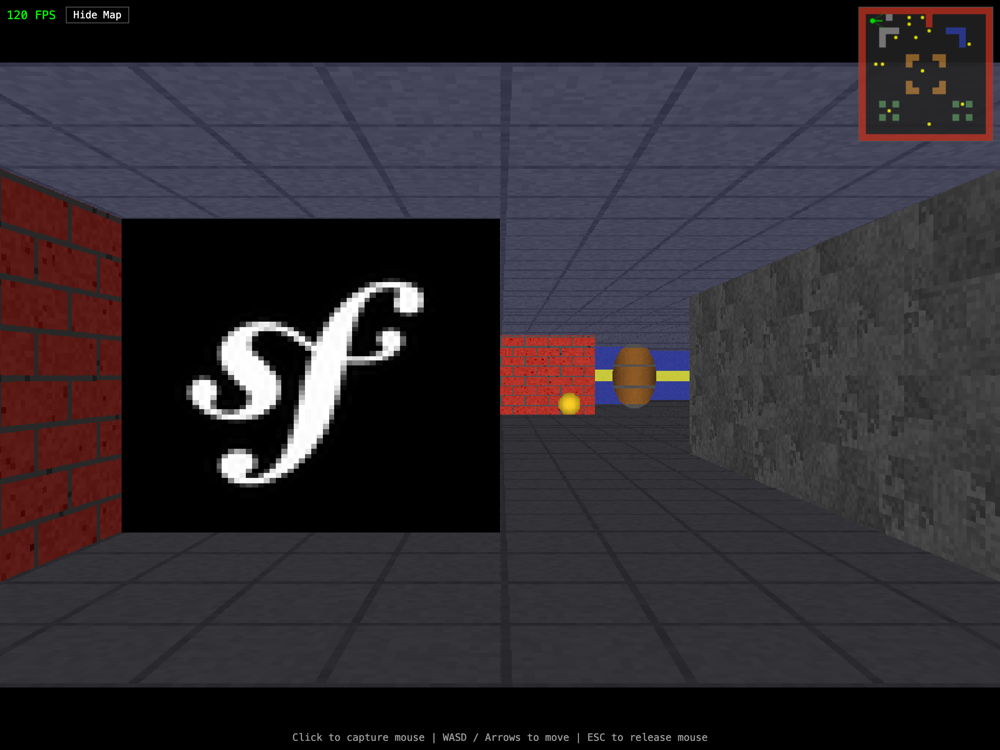
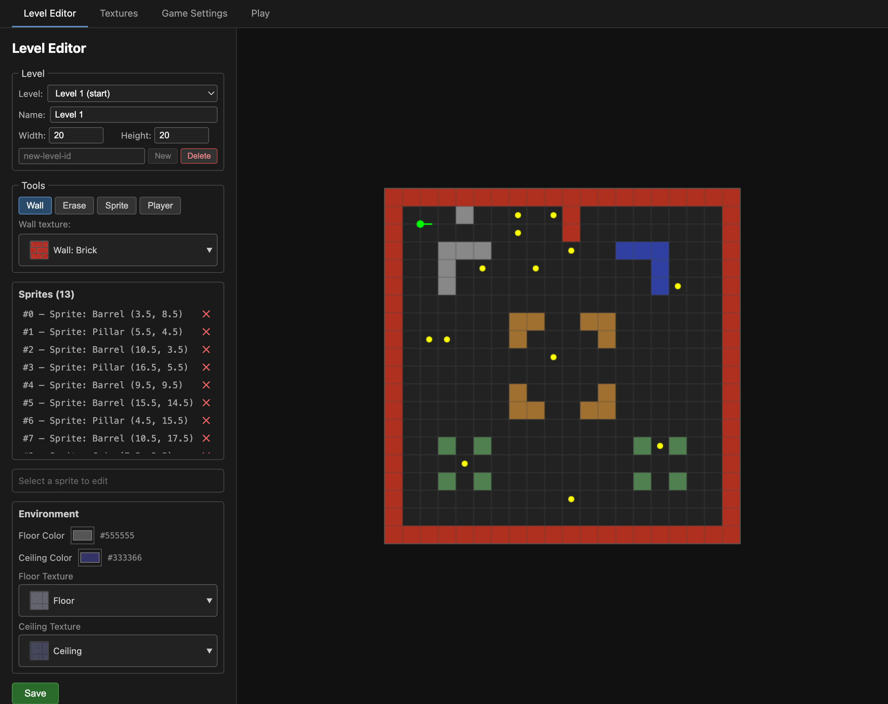

# RT-SvelteKit

A Wolfenstein 3D-style raycasting engine built with SvelteKit, rendered entirely on Canvas 2D (no WebGL). Includes a built-in level editor for creating and managing game levels.





## Features

- **Raycasting engine** — DDA-based wall casting, textured floor/ceiling, sprite rendering with z-buffer
- **First-person controls** — Keyboard (WASD/arrows) + mouse (pointer lock) with wall sliding collision
- **Texture atlas** — All textures composited into a single image at build time via a custom Vite plugin
- **Entities** — Collectible coins, bombs, and teleporters with sound effects (Web Audio API)
- **Multi-level support** — Teleport between levels with customizable spawn points
- **Level editor** (`/admin`) — Visual grid editor for walls, sprites, player spawn, and environment config
- **Texture manager** (`/admin/textures`) — Upload, preview, and delete textures with live atlas rebuild
- **Game settings** (`/admin/settings`) — Configure screen size, movement speeds, and environment
- **Static deployment** — Builds to static files via `adapter-static`, deployable anywhere (GitHub Pages, etc.)

## Tech Stack

- [SvelteKit](https://svelte.dev/docs/kit) with Svelte 5 runes
- [Vite](https://vite.dev) with a custom texture atlas plugin
- [Valibot](https://valibot.dev) for server-side input validation
- [Sharp](https://sharp.pixelplumbing.com) for texture atlas generation
- TypeScript (strict mode)

## Getting Started

### Prerequisites

- Node.js 22+
- pnpm

### Install

```sh
pnpm install
```

### Development

```sh
pnpm run dev
```

Open [http://localhost:5173](http://localhost:5173) to play, and [http://localhost:5173/admin](http://localhost:5173/admin) to access the level editor.

### Build

```sh
pnpm run build
```

The static output is generated in `build/`. Preview it with:

```sh
pnpm run preview
```

### Type Check

```sh
pnpm run check
```

## Project Structure

```
src/
├── lib/
│   ├── engine/          # Raycasting engine (renderer, input, textures, audio, entities)
│   ├── components/      # Game components (RaycastCanvas, Minimap)
│   │   └── editor/      # Level editor components
│   ├── stores/          # Svelte stores (inventory)
│   ├── server/          # Server-side data loading
│   └── vite/            # Custom Vite texture atlas plugin
├── routes/
│   ├── (public)/        # Game page (prerendered)
│   └── (admin)/admin/   # Editor pages (dev only)
data/
├── config.json          # Game settings & texture registry
├── levels/              # Level JSON files
└── textures/            # Texture PNG files (64x64)
```

## Deployment

The project uses GitHub Actions to automatically build and deploy to GitHub Pages on every push to `main`. The workflow is defined in `.github/workflows/deploy.yml`.

To deploy manually, run `pnpm run build` and serve the `build/` directory with any static file server.

## License

Private project.
